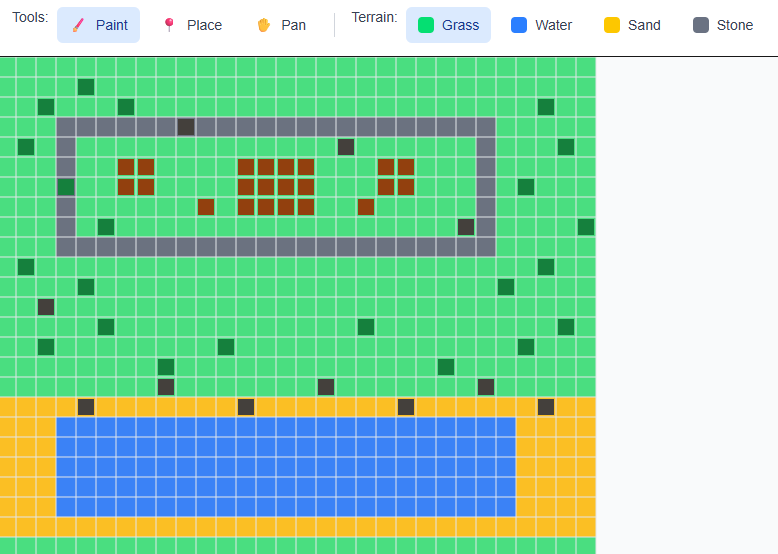

# 🗺️ DnD Map Builder

[](https://nextjs.org/)
[](https://www.typescriptlang.org/)
[](https://tailwindcss.com/)
[](https://zustand-demo.pmnd.rs/)
[](https://opensource.org/licenses/MIT)
[](https://zhuzh.dev)
[](https://vercel.com/new/clone?repository-url=https://github.com/zac-computer/dnd-map-builder)

> A modern, interactive web-based map builder designed for Dungeon Masters to create stunning custom maps for their tabletop RPG campaigns.

## ✨ Features

### 🎨 **Intuitive Map Creation**

- **Grid-based Canvas**: Clean, scalable grid system with smooth pan and zoom controls
- **Terrain Painting**: Paint different terrain types (grass, water, sand, stone) with brush tools
- **Object Placement**: Place and position various objects (trees, rocks, buildings) on your map
- **Multi-tool Interface**: Seamlessly switch between paint, place, and pan tools

### 🔧 **Advanced Functionality**

- **Real-time Rendering**: HTML5 Canvas with optimized performance for large maps
- **Auto-save**: Automatic local storage persistence - never lose your work
- **Responsive Design**: Works seamlessly across desktop and tablet devices
- **Keyboard Shortcuts**: Efficient workflow with hotkey support

### 🚀 **Modern Architecture**

- **Server-Side Rendering**: Next.js 14+ with App Router for optimal performance
- **Type Safety**: Full TypeScript implementation with strict type checking
- **State Management**: Zustand for predictable and performant state updates
- **Styling**: Tailwind CSS for consistent, utility-first styling

## 🎯 Demo

> **🚀 Live Demo**: [https://zhuzh.dev](https://zhuzh.dev) - Try it now!

### Screenshots

_Map Creation Interface_



_Terrain Painting in Action_


> **Interactive Demo**: Watch the terrain painting functionality in action! The demo shows painting different terrain types (grass, water, sand, stone) with smooth brush interactions on the grid-based canvas.

## 🚀 Quick Start

### Prerequisites

- **Node.js** 18.0 or higher
- **npm** 9.0 or higher

### Installation

1. **Clone the repository**

   ```bash
   git clone https://github.com/zac-computer/dnd-map-builder.git
   cd dnd-map-builder
   ```

2. **Install dependencies**

   ```bash
   npm install
   ```

3. **Start the development server**

   ```bash
   npm run dev
   ```

4. **Open your browser**
   Navigate to [http://localhost:3000](http://localhost:3000)

## 🎮 Usage Guide

### Basic Controls

| Tool         | Action       | Description                 |
| ------------ | ------------ | --------------------------- |
| 🖌️ **Paint** | Click & Drag | Paint terrain on grid cells |
| 📍 **Place** | Click        | Place objects on the map    |
| ✋ **Pan**   | Click & Drag | Move around the map         |
| 🔍 **Zoom**  | Mouse Wheel  | Zoom in/out of the map      |

### Terrain Types

- 🌱 **Grass** - Basic ground terrain
- 💧 **Water** - Rivers, lakes, oceans
- 🏖️ **Sand** - Beaches, deserts
- 🗿 **Stone** - Rocky terrain, pathways

### Objects

- 🌳 **Trees** - Forest elements
- 🪨 **Rocks** - Natural obstacles
- 🏠 **Buildings** - Structures and settlements

### Available Demo Maps

#### 1. 🏨 The Riverside Tavern (30×25 grid)

- Setting: Cozy tavern by a river with a small village
- Features: Stone roads connecting buildings, grassy areas, flowing river with sandy banks
- Objects: Main tavern building, village houses, scattered trees, riverside rocks
- Use Case: Perfect for starting adventures, NPC interactions, or safe haven

#### 2. ⛰️ Treacherous Mountain Pass (25×20 grid)

- Setting: Narrow mountain pass with rocky terrain
- Features: Stone mountain walls, grassy valley path winding through
- Objects: Large boulder formations for cover, scattered rocks, hardy mountain trees
- Use Case: Perfect for ambushes, tactical encounters, or dangerous travel

## 🏗️ Project Structure

```
src/
├── app/                    # Next.js App Router
│   ├── (dashboard)/       # Dashboard route group
│   ├── globals.css        # Global styles
│   ├── layout.tsx         # Root layout
│   └── page.tsx           # Home page
├── components/
│   ├── core/              # Core application components
│   │   ├── Canvas.tsx     # Main canvas component
│   │   └── Toolbar.tsx    # Tool selection interface
│   └── ui/                # Reusable UI components
│       ├── Button.tsx     # Button component
│       └── Tooltip.tsx    # Tooltip component
├── lib/
│   ├── hooks/             # Custom React hooks
│   │   ├── useMapStore.ts # Map store hook
│   │   └── useMapPersistence.ts # Persistence hook
│   └── utils.ts           # Utility functions
└── stores/
    └── mapStore.ts        # Zustand state management
```

## 🛠️ Development

### Available Scripts

```bash
# Development
npm run dev          # Start development server
npm run build        # Build for production
npm run start        # Start production server

# Code Quality
npm run lint         # Run ESLint
npm run type-check   # Run TypeScript compiler
npm run format       # Format code with Prettier
npm run format:check # Check code formatting
```

### 🤖 Working with Claude Code

This project is optimized for development with [Claude Code](https://claude.ai/code), Anthropic's CLI tool for AI-assisted coding. Claude Code has full context of this project through the `CLAUDE.md` file.

#### Quick Start with Claude Code

1. **Install Claude Code** (if not already installed)

   ```bash
   npm install -g @anthropic-ai/claude-code
   # Ref: https://docs.anthropic.com/claude-code
   ```

2. **Navigate to project directory**

   ```bash
   cd dnd-map-builder
   ```

3. **Start Claude Code**
   ```bash
   claude
   ```

#### What Claude Code Can Help With

- **Feature Development**: "Add a new terrain type for mountains"
- **Bug Fixes**: "The canvas isn't responding to mouse events on mobile"
- **Code Refactoring**: "Extract the canvas rendering logic into separate functions"
- **Component Creation**: "Create a new sidebar component for map settings"
- **State Management**: "Add undo/redo functionality to the map store"
- **Testing**: "Add unit tests for the map utilities"
- **Performance**: "Optimize the canvas rendering for large grids"

#### Example Commands

```bash
# Add new features
"Add a grid size selector to the toolbar"
"Implement keyboard shortcuts for tool switching"

# Fix issues
"The terrain colors aren't showing correctly"
"Objects are not positioning properly when zoomed"

# Code improvements
"Add TypeScript interfaces for the canvas events"
"Refactor the map store to use immer for immutable updates"

# Documentation
"Update the component documentation with JSDoc comments"
"Create a troubleshooting section for common issues"
```

#### Project Context

Claude Code understands:

- **Architecture**: Next.js 15+ with App Router, TypeScript, Zustand
- **Components**: Canvas, Toolbar, UI components structure
- **State**: Map store with terrain, objects, and view state
- **Persistence**: Local storage implementation
- **Styling**: Tailwind CSS patterns used throughout

#### Best Practices with Claude Code

- **Be Specific**: Instead of "fix the canvas", say "fix the canvas zoom not centering properly"
- **Provide Context**: Mention which files are involved when reporting issues
- **Ask for Explanations**: Request explanations of complex implementations
- **Request Tests**: Ask for unit tests when adding new functionality
- **Code Review**: Have Claude Code review your changes for best practices

### Architecture Decisions

**🏗️ Next.js 14+ with App Router**

- Server-side rendering for better SEO and performance
- Modern React features with Server Components
- Optimized bundling and code splitting

**🎯 Zustand for State Management**

- Lightweight alternative to Redux
- Excellent TypeScript support
- Minimal boilerplate with maximum flexibility

**🎨 HTML5 Canvas for Rendering**

- High-performance graphics rendering
- Precise control over drawing operations
- Scalable for large grid systems

**💾 Local Storage Persistence**

- Instant save/load without server requirements
- Perfect for prototype and MVP phase
- Seamless user experience

## 🔮 Roadmap

### Version 1.1 - Enhanced Features

- [ ] **Layer System** - Multiple map layers for complex designs
- [ ] **Custom Objects** - Import and use custom object sprites
- [ ] **Advanced Terrain** - More terrain types and textures
- [ ] **Undo/Redo** - Full action history management

### Version 2.0 - Collaboration

- [ ] **Real-time Collaboration** - Multiple users editing simultaneously
- [ ] **Cloud Storage** - Save maps to the cloud
- [ ] **Map Sharing** - Share maps with the community
- [ ] **User Authentication** - Personal map libraries

### Version 3.0 - Advanced Tools

- [ ] **Map Export** - Export to PNG, PDF, or print-ready formats
- [ ] **Dynamic Lighting** - Light sources and shadow effects
- [ ] **Fog of War** - Reveal areas during gameplay
- [ ] **Token Management** - Player and NPC token placement

## 🤝 Contributing

Contributions are welcome! Please feel free to submit a Pull Request.

### Development Setup

1. Fork the repository
2. Create your feature branch (`git checkout -b feature/AmazingFeature`)
3. Commit your changes (`git commit -m 'Add some AmazingFeature'`)
4. Push to the branch (`git push origin feature/AmazingFeature`)
5. Open a Pull Request

### Code Style

- Follow the existing TypeScript and React patterns
- Use Prettier for code formatting
- Write meaningful commit messages
- Add tests for new features

## 🏆 Tech Stack

| Category       | Technology   | Purpose                       |
| -------------- | ------------ | ----------------------------- |
| **Framework**  | Next.js 14+  | React framework with SSR      |
| **Language**   | TypeScript   | Type-safe JavaScript          |
| **Styling**    | Tailwind CSS | Utility-first CSS framework   |
| **State**      | Zustand      | Lightweight state management  |
| **Canvas**     | HTML5 Canvas | High-performance 2D rendering |
| **Storage**    | LocalStorage | Client-side data persistence  |
| **Linting**    | ESLint       | Code quality and consistency  |
| **Formatting** | Prettier     | Code formatting               |

## 📄 License

This project is licensed under the MIT License - see the [LICENSE](LICENSE) file for details.

## 🙏 Acknowledgments

- **Dungeons & Dragons** - For inspiring countless adventures
- **Next.js Team** - For the amazing React framework
- **Tailwind CSS** - For making styling enjoyable
- **Zustand** - For elegant state management
- **The D&D Community** - For continuous inspiration and feedback

## 📞 Contact

**Zac** - GitHub: [@zac-computer](https://github.com/zac-computer)

**Project Link**: [https://github.com/zac-computer/dnd-map-builder](https://github.com/zac-computer/dnd-map-builder)

---

<div align="center">

**⭐ Star this repo if you found it helpful! ⭐**

Made with ❤️ for the D&D community

</div>
